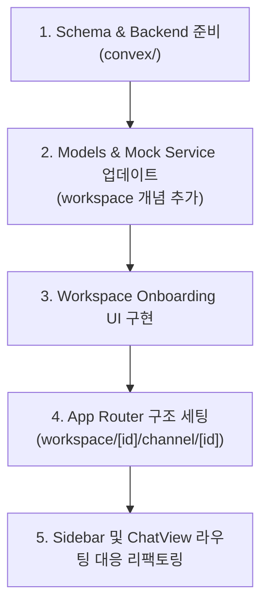

# Phase 1: Real-time Foundation (MVP) - Pre-Integration Step

UI 라우팅 및 온보딩 플로우를 구축하고 Convex 스키마를 준비하되, **프론트엔드 데이터 연동은 아직 Mock 서비스(`mock-chat.service.ts`)를 유지**합니다. Convex 연결 직전 단계까지 구조를 완성하는 것이 목표입니다.

## Current State Summary

| Layer | Status | Details |
|-------|--------|---------|
| **Auth** | ✅ Done | Clerk + Convex JWT 연동, `users` 테이블 + `viewer` query 존재 |
| **Schema** | ⚠️ Minimal | `users` 테이블만 정의됨 |
| **Backend** | ❌ Missing | Workspace/Channel/Message 함수 없음 |
| **Frontend** | ⚠️ Mock | `mock-chat.service.ts`에서 하드코딩된 데이터 사용 중 |
| **Components** | ✅ Ready | Sidebar, ChatHeader, MessageList, MessageBubble, MessageInput 완성 |

---

## Resolved Feedback

> [!NOTE]
> 1. **데이터 연동**: 당분간 `mock-chat.service.ts`를 유지하며, Convex 연결 직전 단계(UI 라우팅, 컴포넌트 구조 변경)까지만 구현합니다.
> 2. **초기 Workspace 생성**: 사용자가 직접 Workspace를 생성하는 **Onboarding Flow**를 만듭니다.
> 3. **채널 기본값**: Workspace 생성 시 `#general` 채널을 자동 생성합니다.
> 4. **메시지 페이지네이션**: 초기 최근 50개 로드 및 스크롤 시 추가 로드하는 방식으로 구현을 준비합니다.

---

## Proposed Changes

### Component 1: Convex Schema 확장 (준비)

데이터베이스 구조를 미리 정의합니다.

#### [MODIFY] [schema.ts](file:///Users/cjungwo/Documents/Project/slack-demo/convex/schema.ts)

```diff
 import { defineSchema, defineTable } from "convex/server";
 import { v } from "convex/values";

 export default defineSchema({
   users: defineTable({
     name: v.optional(v.string()),
     image: v.optional(v.string()),
     externalId: v.string(),
     email: v.string(),
   }).index("by_externalId", ["externalId"]),
+
+  workspaces: defineTable({
+    name: v.string(),
+    ownerId: v.id("users"),
+    joinCode: v.string(),       // 6자리 초대 코드
+    createdAt: v.number(),
+  }).index("by_joinCode", ["joinCode"]),
+
+  members: defineTable({
+    userId: v.id("users"),
+    workspaceId: v.id("workspaces"),
+    role: v.union(v.literal("owner"), v.literal("admin"), v.literal("member")),
+  })
+    .index("by_userId", ["userId"])
+    .index("by_workspaceId", ["workspaceId"])
+    .index("by_userId_and_workspaceId", ["userId", "workspaceId"]),
+
+  channels: defineTable({
+    name: v.string(),
+    workspaceId: v.id("workspaces"),
+    description: v.optional(v.string()),
+    isPrivate: v.boolean(),
+    createdAt: v.number(),
+  }).index("by_workspaceId", ["workspaceId"]),
+
+  messages: defineTable({
+    body: v.string(),
+    authorId: v.id("users"),
+    channelId: v.id("channels"),
+    workspaceId: v.id("workspaces"),
+    updatedAt: v.optional(v.number()),
+  })
+    .index("by_channelId", ["channelId"])
+    .index("by_workspaceId", ["workspaceId"]),
 });
```

---

### Component 2: Convex Backend Functions (준비)

미래를 위해 함수 형태만 미리 구현해 둡니다.

#### [NEW] [workspaces.ts](file:///Users/cjungwo/Documents/Project/slack-demo/convex/workspaces.ts)
- `create` mutation — workspace 생성 + `#general` 채널 자동 생성 + owner member 등록
- `get` query — workspace 단건 조회
- `list` query — 현재 유저가 속한 workspace 목록
- `join` mutation — joinCode로 workspace 참가

#### [NEW] [channels.ts](file:///Users/cjungwo/Documents/Project/slack-demo/convex/channels.ts)
- `create`, `list`, `get` 구현

#### [NEW] [messages.ts](file:///Users/cjungwo/Documents/Project/slack-demo/convex/messages.ts)
- `send`, `list` (paginationOpts 지원, 50개 기준) 구현

---

### Component 3: Frontend 라우팅 및 레이아웃 (핵심 작업)

Mock 서비스 기반으로 동작하는 라우팅 구조를 완성합니다.

#### [NEW] `apps/web/src/app/workspace/[workspaceId]/layout.tsx`
- Workspace 전용 레이아웃. Sidebar를 렌더링하고 `workspaceId` context를 하위 페이지로 전달합니다.

#### [NEW] `apps/web/src/app/workspace/[workspaceId]/channel/[channelId]/page.tsx`
- 개별 채널 페이지. 해당 채널의 메시지를 로드하는 `ChatView`의 컨테이너 역할을 합니다.

#### [NEW] `apps/web/src/app/workspace/[workspaceId]/page.tsx`
- Workspace 진입 시 첫 번째 채널(일반적으로 `#general`)로 redirect 처리합니다.

#### [MODIFY] [page.tsx](file:///Users/cjungwo/Documents/Project/slack-demo/apps/web/src/app/page.tsx)
- 루트 페이지는 Workspace 선택 또는 Onboarding Flow 진입점으로 사용합니다.

---

### Component 4: Workspace 온보딩 플로우 및 Mock 서비스 업데이트

#### [NEW] `apps/web/src/features/workspace/`
- `WorkspaceOnboarding.tsx` — 사용자가 처음 로그인했을 때 표시되는 Workspace 생성 흐름 컴포넌트.

#### [MODIFY] [domain/models.ts](file:///Users/cjungwo/Documents/Project/slack-demo/apps/web/src/features/chat/domain/models.ts)
- `Workspace` 모델을 추가하고, `Channel`, `Message` 모델에 `workspaceId` 속성을 추가합니다.

#### [MODIFY] [chat.service.ts](file:///Users/cjungwo/Documents/Project/slack-demo/apps/web/src/features/chat/services/chat.service.ts) & [mock-chat.service.ts](file:///Users/cjungwo/Documents/Project/slack-demo/apps/web/src/features/chat/services/mock-chat.service.ts)
- `Workspace` 기능(생성, 목록 조회)을 추가합니다.
- 사용자가 온보딩에서 Workspace를 생성하면 Mock 데이터에 저장되고, 자동 생성된 `#general` 채널로 라우팅될 수 있도록 지원합니다.

#### [MODIFY] [ChatView.tsx](file:///Users/cjungwo/Documents/Project/slack-demo/apps/web/src/features/chat/ChatView.tsx)
- 기존의 하드코딩된 상태 관리를 URL 파라미터(`workspaceId`, `channelId`)에 의존하도록 리팩토링합니다.
- 데이터는 여전히 `mock-chat.service.ts`에서 가져옵니다.

#### [MODIFY] [Sidebar.tsx](file:///Users/cjungwo/Documents/Project/slack-demo/apps/web/src/features/chat/components/Sidebar.tsx)
- `onChannelSelect` 이벤트 대신 `next/link` 또는 `useRouter`를 사용하여 `/workspace/[workspaceId]/channel/[channelId]` 형태의 실제 URL 이동을 발생시키도록 변경합니다.

---

## Implementation Order



---

## Verification Plan

### Automated Tests
- TypeScript 빌드 및 린트 검증 (`npm run build`, `npm run lint`)

### Manual Verification (Browser)
1. **루트 진입**: 인증된 사용자가 접속 시 생성된 Workspace가 없으면 Onboarding 화면이 노출되는가?
2. **Onboarding Flow**: 사용자가 Workspace 이름을 입력하고 생성 버튼을 누르면, `/workspace/[id]/channel/[general_id]`로 즉시 라우팅되는가?
3. **URL 기반 라우팅**: 새로고침을 해도 해당 URL의 채널 및 메시지가 정상적으로 로드되는가?
4. **채널 이동**: Sidebar의 채널 목록 클릭 시 URL이 변경되며 해당 채널 화면으로 부드럽게 렌더링되는가?
